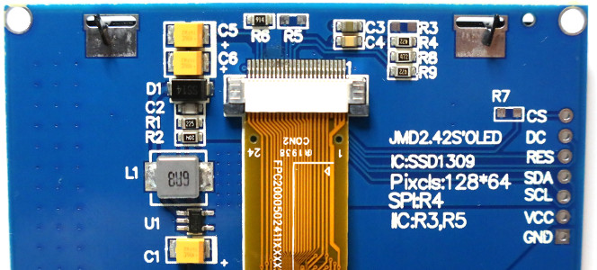
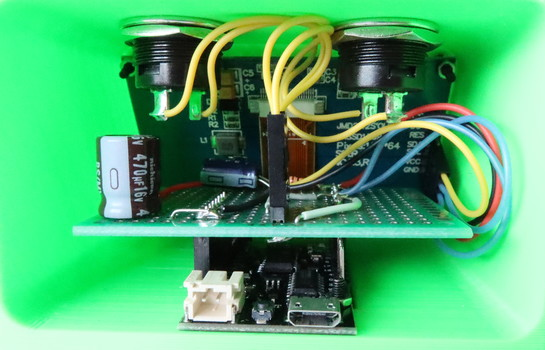
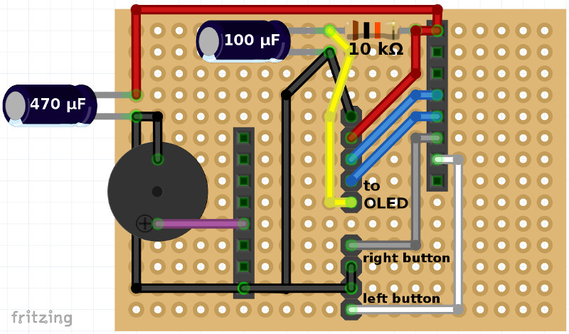

# Case

## Required components

- [Lolin32 Lite](https://www.google.com/search?q=Lolin32+Lite)
- [2.42" SSD1309 based OLED](https://www.google.com/search?q=128x64+oled+i2c+2.42+ssd1309)
- 2 x [R13-507](https://www.google.com/search?q=R13-507) push buttons
- 1 x 6V 470 μF capacitor
- 1 x 6V 100 μF capacitor
- 1 x 10 kΩ resistor
- 4 x M2 hex socket head cap screw, 10-12 mm
  - head cap is visible in the front panel, select accordingly, black hex socket works well
- 2 x M2 hex socket head cap screw, 6-8 mm
  - head cap is hidden under the case and can be anything available
- 6 x M2 nut
- 4 x 2x6 or 2x10 screw (metric, for lid)
- single row 2.54 mm male pin header
  - 4 pins for buttons
  - 5 pins for OLED
  - 2 x 8 pins for Lolin32 Lite (may come with it)
- 2 x 8 pin single row 2.54 mm female pin socket
- 1 x 5 pin single row 2.54 mm female pin header connector
  - for OLED
- 2 x 2 pin single row 2.54 mm female pin header connector
  - for buttons
- 1 x piezo buzzer (optional), 9 mm diameter preferably but 13 mm diamater should also fit
- 1 x [4x6 cm double sided prototype pcb](https://www.google.com/search?q=4x6+cm+double+sided+prototype+pcb)
- 28 AWG (or similar size) wire

Additionally some suitable tools, a soldering iron and access to a 3D printer is needed.

## Printing

Print [case.stl](stl/case.stl) and [lid.stl](stl/lid.stl) using PLA or similar plastic. Use 0.1 - 0.2 mm layer height depending on wanted finish. The case model doesn't need support when printed with the model front facing the bed as shown in the preview. The lid however should be rotated and printed flat.

## OLED I2C setup

The 2.42" SSD1309 based OLED may come by default setup in SPI mode. In that case, the back side of the pcb should look the following:

For I2C mode, remove the resistor R4 and bridge R3, R5 and R7.

## Assembly

1. Clean the case of any excess plastic left after printing.
2. Attach the OLED to the case using the longer M2 screws and nuts. Don't overtighten.
3. Solder pin headers to Lolin32 Lite with pins facing up. If full length pins headers aren't available then start pins from 3V3 and GND on both sides.
4. Attach female pin header connector on top of pin headers from previous step with pins starting from 3V3 on one side and GND on the other side.
5. Place 4x6 cm prototype pcb on top of female pin header connectors and center the board. The unused empty line should be on the side of the USB connector. Solder the female pin header connectors to the pcb.
6. Wire PCB connections according to below image. Keep the components height low when possible. The 100 μF capacitor should be set on its side while the 470 μF capacitor can stay upright even if built further back than shown in the image. Wires for OLED connector (shown as pin header in the image) can be soldered to connect directly to the source pins or other available locations. Connecting the piezo buzzer shown near the 470 μF capacitor is optional.

7. Attach Lolin32 Lite board without the prototype pcb on top of it to the case using the shorter M2 screws / nuts.
8. Connect the display connector from the prototype pcb to the connector on the OLED and attach the prototype pcb on top of Lolin32 lite.
9. Solder wires with connectors to push buttons, make the solder connections face sideways instead of directly down.
10. Attach the push buttons to the case and connect the wires to the prototype pcb.
11. Visually inspect the end result for possible bad connections or extra parts and shake the case to check nothing is loose.
12. Screw the back lid close.

Continue with [Configuration](Configuration.md).
