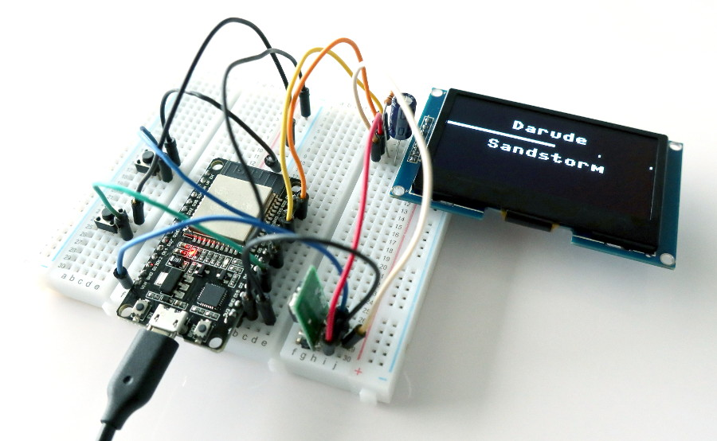
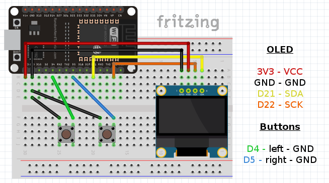

# micropython-spotify-status-display

Micropython implementation for ESP32 using a small OLED display to show the "currently playing" information of a Spotify playback device. Optionally two buttons can be added for controlling the playback device. For normal usability, having the buttons is recommended.

## Features

- "currently playing" track shown with artist name and progress bar
- playback control
  - play/pause
  - next track
  - add current track to library
- configurable poll interval and behaviour
- access token stored in device after initial login
- screensaver for standby mode
- self contained implementation

## Requirements

- ESP32 with [micropython](https://micropython.org/) 1.13 or later
- SSD1306 or SSD1309 compatible 128x64 pixel OLED display in i2c mode
  - verified
    - [0.96" SSD1306](https://www.google.com/search?q=128x64+oled+i2c+0.96+ssd1306)
    - [2.42" SSD1309](https://www.google.com/search?q=128x64+oled+i2c+2.42+ssd1309) (recommended)
  - most likely ok
    - [1.3" SSD1306](https://www.google.com/search?q=128x64+oled+i2c+1.3+ssd1306)
  - not verified
    - [1.3" SH1106](https://www.google.com/search?q=128x64+oled+i2c+1.3+sh1106)
- wlan connectivity
- Spotify account, Premium needed for playback control

## Limitations

- buttons don't react during api requests
- buttons require Spotify Premium due to api restrictions
- default font shows correctly mainly us-ascii characters
- playback device isn't aware of the status display resulting in delay status changes when the playback device is directly controlled

## TODO

- find and fix possible edge cases in api usage
- async api requests (if possible)
- 3D printed case or other more permanent solution
  - partially done for Lolin32 lite + 2.42" OLED, open back wall design [available](stl/case.stl)

## Getting started

### Wiring

Example connections for "ESP32 DevKit v1" and "Geekcreit 30 Pin" pins using a SSD1306 based OLED. Pins may vary on other ESP32 boards.

#### SSD1306 OLED

For 0.96" and 1.3" OLEDs using the SSD1306 chip in i2c mode.

| ESP32 | OLED |
| --- | --- |
| 3V3 | VCC |
| GND | GND |
| D21 | SDA |
| D22 | SCK |

#### SSD1309 OLED

For 2.42" OLEDs using the SSD1309 chip in i2c mode. Note that most of these OLEDs require resistors to be moved for enabling the i2c mode.

| ESP32 | OLED |
| --- | --- |
| 3V3 | VCC |
| GND | GND |
| D21 | SDA |
| D22 | SCL |

A capacitor of around 220-470 μF is needed between ESP32 3V3 and GND in order to avoid brownout during wlan startup when OLED is being active at the same time. This issue can be seen as a "Brownout detector was triggered" console message followed by a forced reset.

Additionally, OLED RES needs to be connected to OLED VCC using a 10 kΩ resistor and to GND using a 10-100 μF capacitor.

| OLED | component | OLED |
| --- | --- | ---
| RES | 10 kΩ resistor | VCC |
| RES | 10-100 μF capacitor | GND |

#### Buttons

| ESP32 | button | ESP32 |
| --- | --- | --- |
| D4 | left button | GND |
| D5 | right button | GND |

Button pins need to support internal pullups.

### Getting Spotify client_id and client_secret

1. Login do [Spotify developer dashboard](https://developer.spotify.com/dashboard/login)
2. Select "Create an app"
3. Fill "Status display" or similar as app name, description can be a link to this project or anything else
4. Click "Edit setting" and add `http://spostatus.local/callback/` as "Redirect URI"
   - `spostatus` needs to match the `mdns` name configured in the next section
   - `http://` prefix and `.local/callback/` must remain as shown
5. Save the settings dialog
6. Click "Show client secret" and take note of both "Client ID" and "Client Secret"

### src/config.json

1. Fill `client_id` and `client_secret` with values acquired in previous step
2. Fill `pins` section according to used wiring
3. Fill `wlan` section, use `mdns` value selected in previous step

### Final steps

1. Using a serial connection to micropython command line, `put` the content of `src` directory to the root of the device
2. Start `repl` and soft reset the device with ctrl-d
3. Fix any possible configuration errors based on shown output
4. Login to Spotify using the provided url and accept requested permissions

If a Spotify device doesn't currently have playback active then the display should reflect the situation. Start playback and the display should react to the change within the configured poll interval.

## Controls

Left button controls play/pause/resume with short presses. A long press (>= 500 ms by default) will result in the currently playing track to be saved to the user library (equivalent for pressing the heart symbol in the normal Spotify interface).

Right button requests the next track to be started.

Pressing left button during standby will wake up the display and try to resume playback. Pressing right button during standby only wakes up the display.

## Included 3rd party implementations

| file | description |
| --- | --- |
| `ssd1306.py` | <https://github.com/adafruit/micropython-adafruit-ssd1306> |
| `uurequests.py` | based on <https://github.com/pfalcon/pycopy-lib/blob/master/uurequests/uurequests.py> |
| `helpers.py` | reduced from <https://github.com/blainegarrett/urequests2> |
