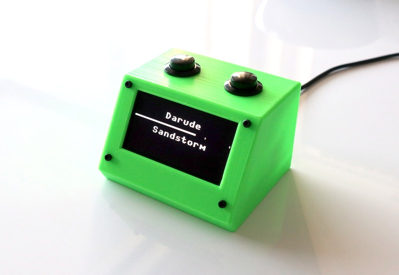

# micropython-spotify-status-display

Micropython implementation for ESP32 using a small OLED display to show the "currently playing" information of a Spotify playback device. Optionally two buttons can be added for controlling the playback device. For normal usability, having the buttons is recommended.

## Features

- "currently playing" track shown with artist name and progress bar
- playback control
  - play/pause
  - next track
  - add current track to library
- configurable poll interval and behaviour
- access token stored in device after initial login
- screensaver for standby mode
- self contained implementation
- [custom 3D printable case](stl/case.stl)

## Requirements

- ESP32 with [micropython](https://micropython.org/) 1.14 or later
  - version 1.18 or later recommended
- SSD1306 or SSD1309 compatible 128x64 pixel OLED display in i2c mode
  - verified
    - [0.96" SSD1306](https://www.google.com/search?q=128x64+oled+i2c+0.96+ssd1306)
    - [2.42" SSD1309](https://www.google.com/search?q=128x64+oled+i2c+2.42+ssd1309) (recommended)
  - most likely ok
    - [1.3" SSD1306](https://www.google.com/search?q=128x64+oled+i2c+1.3+ssd1306)
  - not verified
    - [1.3" SH1106](https://www.google.com/search?q=128x64+oled+i2c+1.3+sh1106)
- wlan connectivity
- Spotify account, Premium needed for playback control

See also beginning of [Case.md](Case.md) for a full list of needed components for building the cased solution shown above.

## Limitations

- buttons don't react during api requests
- buttons require Spotify Premium due to api restrictions
- default font shows correctly mainly us-ascii characters
- playback device isn't aware of the status display resulting in delayed status changes when the playback device is directly controlled

## TODO

- find and fix possible edge cases in api usage
- async api requests (if possible)

## Building it

- [3D printed case build](Case.md) or [DIY wiring](Wiring.md)
- [Configuration](Configuration.md)

## Controls

| | Left button | Right button |
| --- | --- | --- |
| active, short press | play / pause / resume | next track |
| active, long press | save track | - |
| standby | wake up and resume playback | wake up |

Long press is >= 500 ms by default.

## Included 3rd party implementations

| file | description |
| --- | --- |
| `ssd1306.py` | based on <https://github.com/adafruit/micropython-adafruit-ssd1306> |
| `uurequests.py` | based on <https://github.com/pfalcon/pycopy-lib/blob/master/uurequests/uurequests.py> |
| `helpers.py` | reduced from <https://github.com/blainegarrett/urequests2> |
